# Architecture Overview

The SMB AI Command Platform uses a hybrid microservices architecture combining Node.js/TypeScript and Python/FastAPI.

## System Architecture

```mermaid
flowchart TB
    subgraph Clients["🖥️ Client Applications"]
        direction LR
        WEB["🌐 Web App<br/>(React)"]
        MOBILE["📱 Mobile<br/>(PWA)"]
        MCPCLI["🤖 MCP CLI<br/>(Claude)"]
        THIRD["🔗 Third-party<br/>(via API)"]
    end

    subgraph Gateway["🚪 API Gateway - Node.js/TypeScript + Fastify"]
        direction LR
        AUTH["🔐 Authentication"]
        RATE["⏱️ Rate Limiting"]
        TENANT["🏢 Tenant Routing"]
        LOG["📝 Logging"]
    end

    subgraph Services["⚙️ Backend Services"]
        direction LR
        subgraph AI["🧠 AI Orchestrator<br/>(Python/FastAPI)"]
            LLM["LLM Providers"]
            ROUTER["Query Router"]
            PLANNER["Task Planner"]
            EXEC["Tool Execution"]
        end

        subgraph CONN["🔌 Connectors<br/>(Python/FastAPI)"]
            SHOP["Shopify"]
            STRIPE["Stripe"]
            QB["QuickBooks"]
            HUB["HubSpot"]
        end

        subgraph MODULES["📦 Modules"]
            OPS["Ops Copilot"]
            MINI["Mini Foundry"]
            SEC["Security Scanner"]
            MARKET["Marketplace"]
        end
    end

    subgraph Data["💾 Data Layer"]
        direction LR
        PG["🐘 PostgreSQL<br/>Primary DB"]
        REDIS["⚡ Redis<br/>Cache"]
        KAFKA["📨 Kafka<br/>Events"]
        QDRANT["🔍 Qdrant<br/>Vectors"]
    end

    Clients --> Gateway
    Gateway --> Services
    Services --> Data

    style Gateway fill:#0ea5e9,color:#fff
    style AI fill:#8b5cf6,color:#fff
    style CONN fill:#10b981,color:#fff
    style MODULES fill:#f59e0b,color:#fff
    style Data fill:#0369a1,color:#fff
```



## Component Details

### API Gateway (Node.js/TypeScript)

The gateway handles all incoming requests and provides:

- **Authentication**: JWT-based auth with refresh tokens
- **Rate Limiting**: Protect against abuse (100 req/min default)
- **Tenant Isolation**: Extract and validate tenant context
- **Request Routing**: Route to appropriate backend services
- **Response Transformation**: Normalize responses across services

**Tech Stack:**
- Fastify (high-performance web framework)
- @fastify/jwt (authentication)
- @fastify/rate-limit (rate limiting)
- Winston (logging)

### AI Orchestrator (Python/FastAPI)

Handles all AI-related operations:

- **LLM Providers**: OpenAI, Anthropic, with fallback support
- **Query Router**: Classify user intent and route to handlers
- **Task Planner**: Create multi-step execution plans
- **Tool Execution**: Execute actions on behalf of users

**Tech Stack:**
- FastAPI (async web framework)
- LangChain (LLM orchestration)
- Pydantic (validation)
- httpx (async HTTP client)

### Connectors Service (Python/FastAPI)

Manages third-party integrations:

- **OAuth Flows**: Handle authentication with external services
- **Data Sync**: Pull data from connected services
- **Webhook Handling**: Process incoming webhooks
- **Credential Management**: Secure storage of API keys

### Data Layer

#### PostgreSQL
Primary relational database for structured data:
- Users and authentication
- Tenant configuration
- Workflows and automations
- Audit logs

#### Redis
High-speed caching and sessions:
- Session storage
- Rate limiting counters
- Query result caching
- Real-time data

#### Kafka
Event streaming for async operations:
- Data sync events
- Webhook processing
- Audit trail
- Inter-service communication

#### Qdrant
Vector database for AI features:
- Semantic search embeddings
- Document similarity
- RAG context retrieval

## Multi-Tenancy

All data is isolated by tenant. The architecture enforces tenant isolation at multiple levels:

1. **Gateway Level**: Tenant ID extracted from JWT or header
2. **Service Level**: Tenant context propagated via headers
3. **Database Level**: All queries filtered by `tenant_id`

```typescript
// Every request carries tenant context
headers: {
  'Authorization': 'Bearer <jwt>',
  'X-Tenant-Id': 'tenant_123',
  'X-Request-Id': 'req_abc'
}
```

## Security Model

- All inter-service communication is authenticated
- Secrets stored in AWS Secrets Manager (production)
- Database credentials rotated automatically
- All data encrypted at rest and in transit
