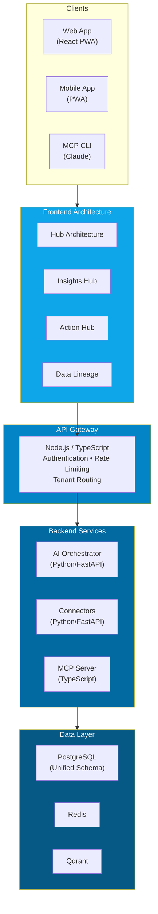

# Introduction

Welcome to the **SMB AI Command Platform** documentation.

## What is SMB AI Command Platform?

SMB AI Command Platform is a modular AI-powered SaaS platform designed specifically for Small and Medium Businesses. It provides intelligent automation, data insights, security monitoring, and competitive intelligence - all accessible through natural language queries and a unified **hub-based architecture**.

## Platform Architecture

The platform is organized into two main hubs that consolidate all business intelligence:

### Insights Hub
Your central command center for understanding your business:
- **Overview** - Key metrics, trends, and alerts at a glance
- **Forecasts** - AI-powered predictive analytics
- **Customers** - Customer health, LTV, and churn analysis
- **Segments** - Visual customer segmentation
- **Market Intel** - Competitor and pricing intelligence
- **Reports** - Automated report generation

### Action Hub
Transform insights into results:
- **Simulator** - "What-if" scenario modeling with causal graphs
- **Planner** - Business initiative tradeoff analysis
- **Automations** - Workflow automation management
- **History** - Track all actions and their outcomes

### Data Lineage
Trust your data with full transparency:
- **Provenance Tracking** - Know where every data point comes from
- **Quality Scores** - Accuracy, completeness, and freshness metrics
- **Flow Visualization** - Visual data flow diagrams

## Core Modules

### Ops Copilot
Automate your daily operations with AI-powered task management, email automation, and workflow orchestration.

**Key Features:**
- Natural language task creation
- Email compose & send automation
- Calendar management
- CRM integration
- Workflow automation

### Mini Foundry
Consolidate your business data and gain actionable insights with AI-powered analytics.

**Key Features:**
- Unified data layer across all your tools
- Natural language data queries
- Auto-generated dashboards
- Revenue forecasting
- KPI tracking

### Cybersecurity Scanner
Monitor your security posture and maintain compliance with automated security checks.

**Key Features:**
- MFA status monitoring
- Device health checks
- Compliance reports (SOC2, HIPAA)
- Security alerts
- Access audit logs

### Marketplace Intelligence
Stay competitive with real-time pricing intelligence and market analysis.

**Key Features:**
- Competitor price tracking
- Product performance analytics
- Market trend detection
- Multi-marketplace support (Amazon, Shopify, Etsy, eBay)

### Predictive Analytics (NEW)
Leverage AI to forecast business outcomes with 518 pre-built prediction templates across 19 industries.

**Key Features:**
- Industry-specific prediction templates
- Time-series forecasting
- Anomaly detection
- Revenue and demand predictions
- Churn risk analysis

## Architecture Overview



## Three-Layer Data Architecture

1. **Connector Layer** - Raw data ingestion from Shopify, Stripe, HubSpot, Gmail, QuickBooks
2. **Normalization Layer** - "Rosetta Stone" unified schema for cross-platform data
3. **Semantic Layer** - AI-enriched data with causal relationships and predictions

## Quick Start

Get started in minutes:

```bash
# Clone the repository
git clone --recursive https://github.com/k5tuck/binelekv2-smb-platform-backend.git

# Start with Docker
cd binelekv2-smb-platform-backend
cp .env.example .env
docker-compose up -d
```

## Support

- **Documentation**: You're here!
- **GitHub Issues**: [Report bugs](https://github.com/k5tuck/binelekv2-smb-platform-backend/issues)
- **Email**: support@smb-ai-platform.com
