# Introduction

Welcome to the **SMB AI Command Platform** documentation.

## What is SMB AI Command Platform?

SMB AI Command Platform is a modular AI-powered SaaS platform designed specifically for Small and Medium Businesses. It provides intelligent automation, data insights, security monitoring, and competitive intelligence - all accessible through natural language queries.

## Core Modules

### 🤖 Ops Copilot
Automate your daily operations with AI-powered task management, email automation, and workflow orchestration.

**Key Features:**
- Natural language task creation
- Email compose & send automation
- Calendar management
- CRM integration
- Workflow automation

### 📊 Mini Foundry
Consolidate your business data and gain actionable insights with AI-powered analytics.

**Key Features:**
- Unified data layer across all your tools
- Natural language data queries
- Auto-generated dashboards
- Revenue forecasting
- KPI tracking

### 🔒 Cybersecurity Scanner
Monitor your security posture and maintain compliance with automated security checks.

**Key Features:**
- MFA status monitoring
- Device health checks
- Compliance reports (SOC2, HIPAA)
- Security alerts
- Access audit logs

### 📈 Marketplace Intelligence
Stay competitive with real-time pricing intelligence and market analysis.

**Key Features:**
- Competitor price tracking
- Product performance analytics
- Market trend detection
- Multi-marketplace support (Amazon, Shopify, Etsy, eBay)

## Architecture Overview

```mermaid
flowchart TB
    subgraph Clients["👤 Clients"]
        WEB["🌐 Web App<br/>(React PWA)"]
        MOBILE["📱 Mobile App<br/>(PWA)"]
        MCP["🤖 MCP CLI<br/>(Claude)"]
    end

    subgraph Gateway["🚪 API Gateway"]
        GW["Node.js / TypeScript<br/>Authentication • Rate Limiting<br/>Tenant Routing"]
    end

    subgraph Services["⚙️ Backend Services"]
        AI["🧠 AI Orchestrator<br/>(Python/FastAPI)"]
        CONN["🔌 Connectors<br/>(Python/FastAPI)"]
        MCPS["📡 MCP Server<br/>(TypeScript)"]
    end

    subgraph Data["💾 Data Layer"]
        PG["🐘 PostgreSQL"]
        REDIS["⚡ Redis"]
        QDRANT["🔍 Qdrant"]
    end

    WEB --> GW
    MOBILE --> GW
    MCP --> GW
    GW --> AI
    GW --> CONN
    GW --> MCPS
    AI --> Data
    CONN --> Data

    style Gateway fill:#0ea5e9,color:#fff
    style Services fill:#0284c7,color:#fff
    style Data fill:#0369a1,color:#fff
```



## Quick Start

Get started in minutes:

```bash
# Clone the repository
git clone --recursive https://github.com/k5tuck/binelekv2-smb-platform-backend.git

# Start with Docker
cd binelekv2-smb-platform-backend
cp .env.example .env
docker-compose up -d
```

## Support

- **Documentation**: You're here!
- **GitHub Issues**: [Report bugs](https://github.com/k5tuck/binelekv2-smb-platform-backend/issues)
- **Email**: support@smb-ai-platform.com
