# System Architecture Overview

## Executive Summary

The SMB AI Command Platform is a multi-tenant SaaS application that provides AI-powered business operations tools for small and medium businesses. The system uses a hybrid architecture combining Node.js/TypeScript for the API Gateway and Python/FastAPI for AI-intensive services.

## Architecture Principles

1. **Microservices-based** - Independent, deployable services with clear boundaries
2. **API-first** - All functionality exposed through well-defined APIs
3. **Multi-tenant by design** - Tenant isolation at every layer
4. **Cloud-native** - Containerized, scalable, and resilient
5. **AI-ready** - Infrastructure optimized for LLM and ML workloads

## System Architecture Diagram

```mermaid
flowchart TB
    subgraph LB["☁️ Load Balancer"]
        ALB["AWS ALB / CloudFlare"]
    end

    subgraph Clients["🖥️ Client Applications"]
        direction LR
        WEB["🌐 Web App<br/>(React)"]
        MOBILE["📱 Mobile App<br/>(PWA)"]
        MCPS["🤖 MCP Server<br/>(Claude)"]
    end

    subgraph Gateway["🚪 API Gateway - Node.js/TypeScript + Fastify"]
        GW_AUTH["🔐 JWT Authentication"]
        GW_RATE["⏱️ Rate Limiting (100 req/min)"]
        GW_TENANT["🏢 Tenant Context Extraction"]
        GW_ROUTE["🔀 Request Routing"]
        GW_TRANS["📤 Response Transformation"]
    end

    subgraph Services["⚙️ Backend Services"]
        subgraph AI["🧠 AI Orchestrator<br/>(Python/FastAPI)"]
            AI_LLM["LLM Providers"]
            AI_ROUTER["Query Router"]
            AI_PLAN["Task Planner"]
            AI_EXEC["Tool Executor"]
        end

        subgraph CONN["🔌 Connectors<br/>(Python/FastAPI)"]
            C_SHOP["Shopify"]
            C_STRIPE["Stripe"]
            C_QB["QuickBooks"]
            C_HUB["HubSpot"]
            C_GMAIL["Gmail"]
            C_OAUTH["OAuth Flows"]
        end

        subgraph MODS["📦 Module Services<br/>(Planned)"]
            M_OPS["Ops Copilot"]
            M_MINI["Mini Foundry"]
            M_SEC["Security Scanner"]
            M_MARKET["Marketplace Intel"]
        end
    end

    subgraph Data["💾 Data Layer"]
        subgraph PG["🐘 PostgreSQL"]
            PG_USERS["Users"]
            PG_TENANTS["Tenants"]
            PG_DATA["Data"]
        end

        subgraph REDIS["⚡ Redis"]
            R_SESS["Sessions"]
            R_RATE["Rate Limits"]
            R_CACHE["Query Cache"]
        end

        subgraph QDRANT["🔍 Qdrant"]
            Q_EMB["Embeddings"]
            Q_SEM["Semantic Search"]
        end

        subgraph KAFKA["📨 Kafka"]
            K_SYNC["Data Sync"]
            K_HOOK["Webhooks"]
            K_AUDIT["Audit Log"]
        end
    end

    LB --> Clients
    Clients --> Gateway
    Gateway --> Services
    Services --> Data

    style LB fill:#64748b,color:#fff
    style Gateway fill:#0ea5e9,color:#fff
    style AI fill:#8b5cf6,color:#fff
    style CONN fill:#10b981,color:#fff
    style MODS fill:#f59e0b,color:#fff
    style PG fill:#336791,color:#fff
    style REDIS fill:#dc382d,color:#fff
    style QDRANT fill:#24b47e,color:#fff
    style KAFKA fill:#231f20,color:#fff
```

## Service Responsibilities

### API Gateway (Node.js/TypeScript)
- **Primary responsibility**: Entry point for all client requests
- **Technology**: Fastify, TypeScript, JWT
- **Scaling**: Horizontal (multiple instances behind load balancer)
- **Key functions**:
  - Authenticate and authorize requests
  - Extract tenant context
  - Route requests to appropriate services
  - Apply rate limiting
  - Transform responses

### AI Orchestrator (Python/FastAPI)
- **Primary responsibility**: AI query processing and orchestration
- **Technology**: FastAPI, LangChain, OpenAI/Anthropic SDKs
- **Scaling**: Horizontal with GPU support for local models
- **Key functions**:
  - Classify user intent
  - Route to appropriate handlers
  - Execute multi-step AI plans
  - Manage conversation context

### Connectors Service (Python/FastAPI)
- **Primary responsibility**: Third-party integrations
- **Technology**: FastAPI, OAuth2, async HTTP
- **Scaling**: Horizontal
- **Key functions**:
  - OAuth flows for integrations
  - Data synchronization
  - Webhook processing
  - Credential management

## Data Architecture

### PostgreSQL (Primary Database)
- Stores all persistent application data
- Multi-tenant with row-level security
- Connection pooling via PgBouncer in production

### Redis (Caching Layer)
- Session storage
- Rate limiting counters
- Query result caching
- Real-time pub/sub

### Kafka (Event Streaming)
- Async data synchronization
- Webhook event processing
- Audit trail
- Inter-service communication

### Qdrant (Vector Database)
- Semantic search embeddings
- Document similarity
- RAG context retrieval

## Deployment Architecture

### Development
- Docker Compose for local development
- All services run locally
- Hot reloading enabled

### Staging
- AWS ECS Fargate
- Single availability zone
- Reduced capacity

### Production
- AWS ECS Fargate
- Multi-AZ deployment
- Auto-scaling enabled
- CloudFront CDN for frontend
- RDS Multi-AZ for PostgreSQL

## Technology Decisions

| Component | Technology | Rationale |
|-----------|------------|-----------|
| API Gateway | Node.js/Fastify | High performance, good TypeScript support |
| AI Services | Python/FastAPI | Best ecosystem for AI/ML, LangChain support |
| Primary DB | PostgreSQL | Reliable, feature-rich, good multi-tenant support |
| Cache | Redis | Fast, versatile, good Pub/Sub support |
| Events | Kafka | Scalable, durable, industry standard |
| Vectors | Qdrant | Purpose-built for vectors, good performance |
| Container | Docker/ECS | Easy deployment, good AWS integration |
