# Data Flow Documentation

## Overview

This document describes how data flows through the SMB AI Command Platform, including request handling, data synchronization, and event processing.

## Request Flow

### User Query Flow


### Authentication Flow


## Data Synchronization Flow

### Connector Data Sync

```mermaid
flowchart LR
    subgraph Trigger["⏰ Trigger"]
        SCHED["Scheduler<br/>(Cron Job)"]
    end

    subgraph Process["⚙️ Process"]
        CONN["Connectors<br/>Service"]
        KAFKA["Kafka<br/>(Queue)"]
        WORK["Workers"]
    end

    subgraph External["🌐 External"]
        API["External<br/>APIs"]
    end

    subgraph Storage["💾 Storage"]
        TRANS["Transform<br/>& Load"]
        PG["PostgreSQL<br/>(Store)"]
    end

    SCHED --> CONN
    CONN --> KAFKA
    KAFKA --> WORK
    WORK --> API
    API --> TRANS
    TRANS --> PG

    style Trigger fill:#f59e0b,color:#fff
    style Process fill:#0ea5e9,color:#fff
    style External fill:#10b981,color:#fff
    style Storage fill:#8b5cf6,color:#fff
```



### Sync Process Details

1. **Trigger**: Scheduler triggers sync based on plan frequency
2. **Fetch**: Connector service fetches data from external API
3. **Queue**: Raw data pushed to Kafka topic
4. **Process**: Workers consume and transform data
5. **Store**: Transformed data saved to PostgreSQL
6. **Index**: Relevant data indexed in Qdrant for search

### Webhook Processing

```mermaid
sequenceDiagram
    autonumber
    participant Ext as 🌐 External Service
    participant WH as 📥 Webhook Endpoint
    participant K as 📨 Kafka
    participant W as ⚙️ Worker
    participant DB as 💾 Database

    Ext->>WH: POST /webhook

    Note over WH: Validate Signature

    WH-->>Ext: 202 Accepted
    WH->>K: Publish Event
    K->>W: Consume

    Note over W: Process & Update

    W->>DB: Update Data
```



## AI Query Processing

### Intent Classification

```mermaid
flowchart TB
    subgraph Input["📥 Input"]
        Q["User Query"]
    end

    subgraph Router["🔀 Query Router"]
        E["1. Extract Entities<br/>(dates, amounts, products)"]
        C["2. Classify Intent<br/>(metrics, search, action)"]
        I["3. Identify Module<br/>(mini-foundry, ops-copilot)"]
    end

    subgraph Handlers["⚙️ Handlers"]
        direction LR
        M["📊 Metrics<br/>Handler"]
        S["🔍 Search<br/>Handler"]
        A["⚡ Action<br/>Handler"]
    end

    subgraph Details["Handler Details"]
        direction LR
        MD["Revenue<br/>Orders<br/>Customers"]
        SD["Semantic<br/>Keyword<br/>Hybrid"]
        AD["Send email<br/>Create task<br/>Run workflow"]
    end

    subgraph Planner["📋 Task Planner"]
        P1["1. Fetch required data"]
        P2["2. Transform/aggregate"]
        P3["3. Generate NL response"]
    end

    Q --> Router
    Router --> Handlers
    M --> MD
    S --> SD
    A --> AD
    Handlers --> Planner

    style Input fill:#64748b,color:#fff
    style Router fill:#0ea5e9,color:#fff
    style Handlers fill:#8b5cf6,color:#fff
    style Planner fill:#10b981,color:#fff
```



### LLM Integration

```mermaid
flowchart TB
    subgraph Provider["🤖 LLM Provider"]
        subgraph Primary["Primary"]
            GPT["OpenAI GPT-4"]
        end

        subgraph Secondary["Secondary (Fallback)"]
            CLAUDE["Anthropic Claude"]
        end

        GPT -->|Fallback| CLAUDE
    end

    REQ["Request"] --> Provider
    Provider --> RES["Response"]

    style Primary fill:#10b981,color:#fff
    style Secondary fill:#f59e0b,color:#fff
```



## Caching Strategy

### Cache Layers

| Layer | Purpose | TTL | Invalidation |
|-------|---------|-----|--------------|
| Redis L1 | Hot query results | 5 min | On data change |
| Redis L2 | Session data | 1 hour | On logout |
| Redis L3 | Rate limit counters | 1 min | Auto-expire |
| Qdrant | Vector embeddings | Persistent | On re-index |

### Cache Key Structure

```
# Query cache
cache:query:{tenant_id}:{hash(query)}

# Session cache
session:{session_id}

# Rate limit
ratelimit:{tenant_id}:{user_id}:{endpoint}

# Connector data
connector:{tenant_id}:{connector_type}:{resource}
```

## Event Schema

### Data Sync Event

```json
{
  "event_type": "connector.sync.completed",
  "timestamp": "2024-01-15T10:30:00Z",
  "tenant_id": "tenant_123",
  "payload": {
    "connector_id": "conn_shopify_456",
    "connector_type": "shopify",
    "records_synced": 1250,
    "duration_ms": 4523,
    "status": "success"
  }
}
```

### User Action Event

```json
{
  "event_type": "user.query.submitted",
  "timestamp": "2024-01-15T10:30:00Z",
  "tenant_id": "tenant_123",
  "user_id": "user_789",
  "payload": {
    "query": "What was my revenue last month?",
    "intent": "metrics",
    "module": "mini-foundry",
    "response_time_ms": 1234
  }
}
```
